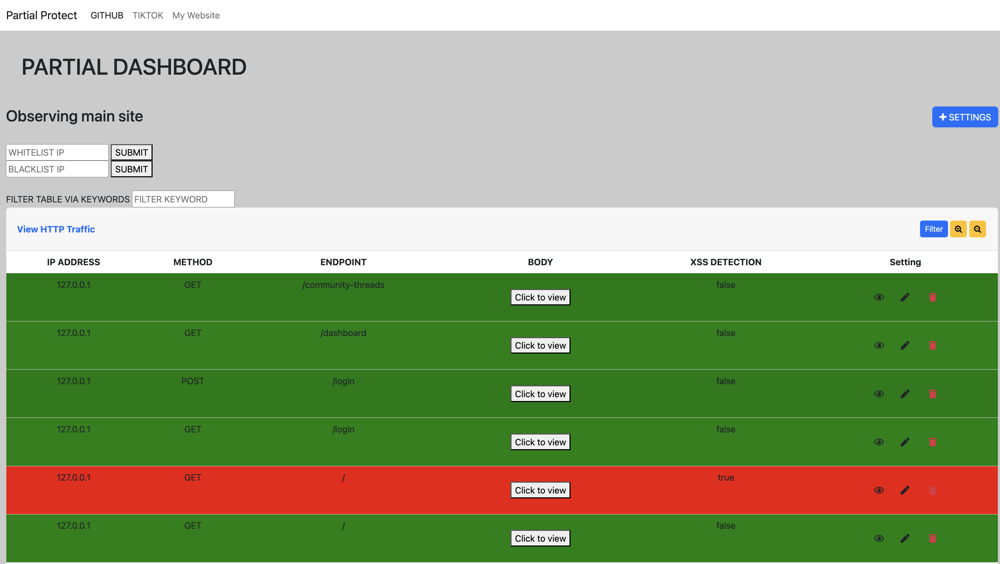
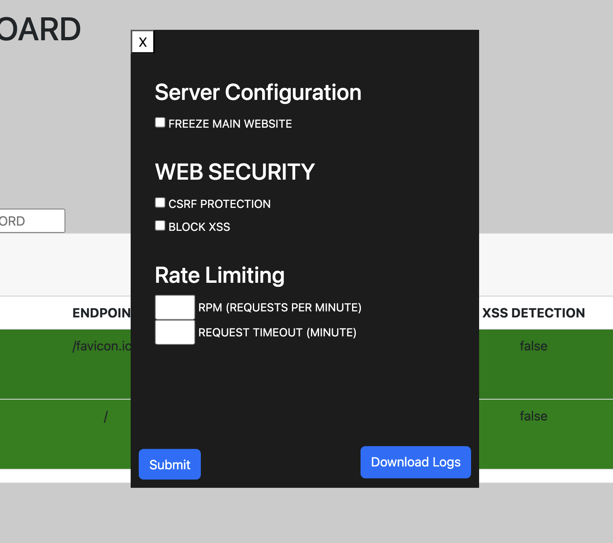

# Partial-WAF

Partial-WAF aims to heavily focus on detecting threats in real time and defending against it. Aimed to be user friendly for small sites trying to have extra security for free.

## Visuals


## Settings option
To view the image just click on the settings button on the right hand side


Front-end was designed using bootstrap studio
## How it works

You will have a dashboard which runs on the localhost. And you can access it on port 278. You will be able to view IP, Request methods, Parameters, Query, and XSS detection. 


## 🛡️ Security Features

| Feature                  | Description                                                                 |
|--------------------------|-----------------------------------------------------------------------------|
| **IP Whitelisting**      | Restricts access to the dashboard to only approved (trusted) IP addresses |
| **IP Blacklisting**      | Blocks specific IP addresses from accessing the main entire website|
| **CSRF Protection**      | Protects against Cross-Site Request Forgery using secure tokens|
| **Rate Limiting**        | Limits the number of requests per minute to prevent web scrapers or any sort of brute forcing attacks|
| **XSS DETECTION**        | Detects cross site scripting requests and alerts on the dashboard with a red table exposing the attacker|

## Installation

In your project path, type

```bash
  npm install github:HamzLDN/Partial-WAF
```

Now, on your express project, add the 2 following lines to deploy
```js
  const partial_middleware = require('Partial-WAF')
  app.use(partial_middleware)
```

Default port should be `278` to acccess on localhost
## Acknowledgements

 - [Bootstrap Studios for front-end](https://bootstrapstudio.io)
 - [Readme template I've used](https://readme.so/editor)

